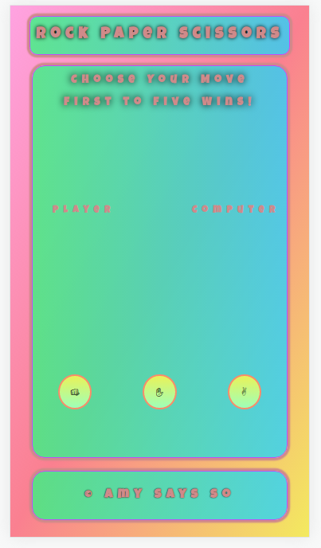
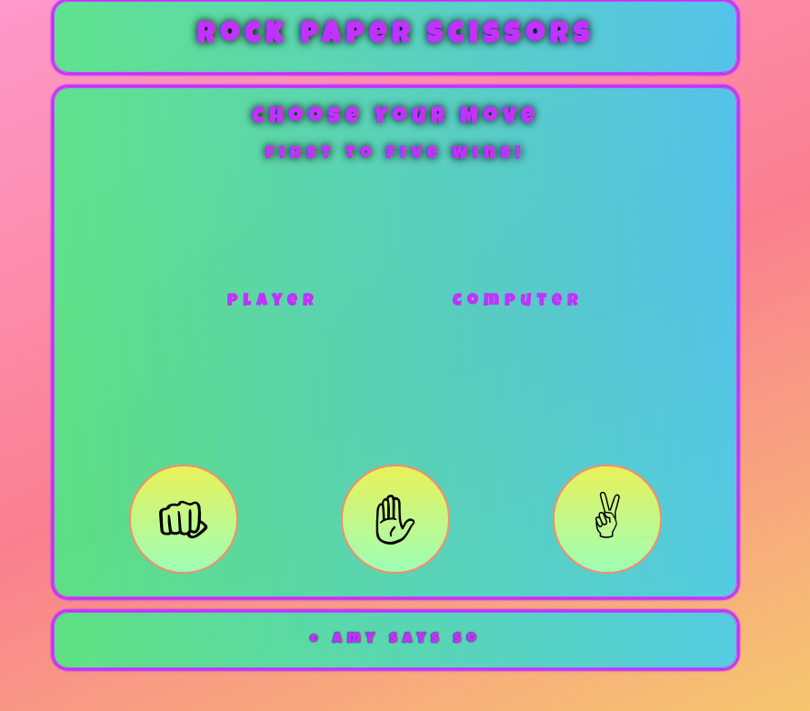

# rps-js

This is an updated version of my Rock Paper Scissors page from The Odin Project. As it was my first JavaScript project, I wanted to go back and have a separate, new repository to gauge progress. Instead of looking at past commits, I chose to have something visual to see differences between.

For this iteration, I focused on practicing making the page responsive to different screen sizes, google lighthouse scores, and organizing/condensing code to become more managable. Additionally, I have been on a CSS kick and wanted to explore uses since as linear-gradients and @media queries to understand breakpoints more.

Below are examples of the page now

The old game was not responsive and had too many nested div and the HTML did not follow any semantic practices.

The playable version of the first browser game and repository are here.
<a href="https://archdukechilly.github.io/rps_game/">Playable Version</a>
<a href="https://github.com/ArchdukeChilly/rps_game'>Repository</a>

the <a href="https://www.theodinproject.com/paths/foundations/courses/foundations/lessons/rock-paper-scissors">instructions</a> for the intial console.log portion of the project are found on <a href="http://www.theodinproject.com"> with the supplemental <a href="https://www.theodinproject.com/paths/foundations/courses/foundations/lessons/revisiting-rock-paper-scissors"> browser capable</a> instructions in a later section.

This whole process has been fun to catalog and see the progress I've made in a few months with working, going to school, trying to be a capable husband and friend, and living life as it throws curveballs at me. My <a href="https://github.com/ArchdukeChilly/rps_game_attempt1'>original attempt</a> feels like years ago.
