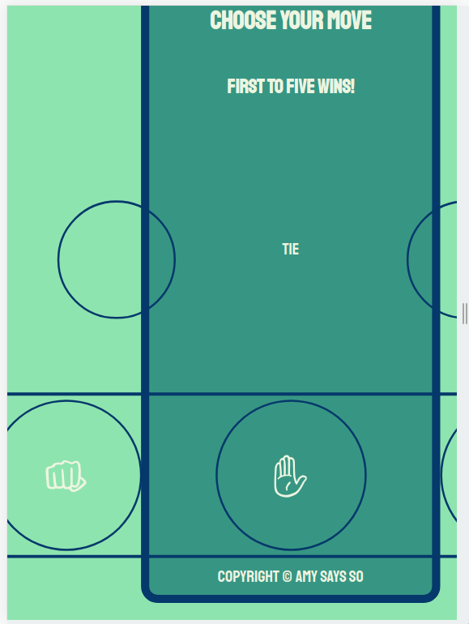
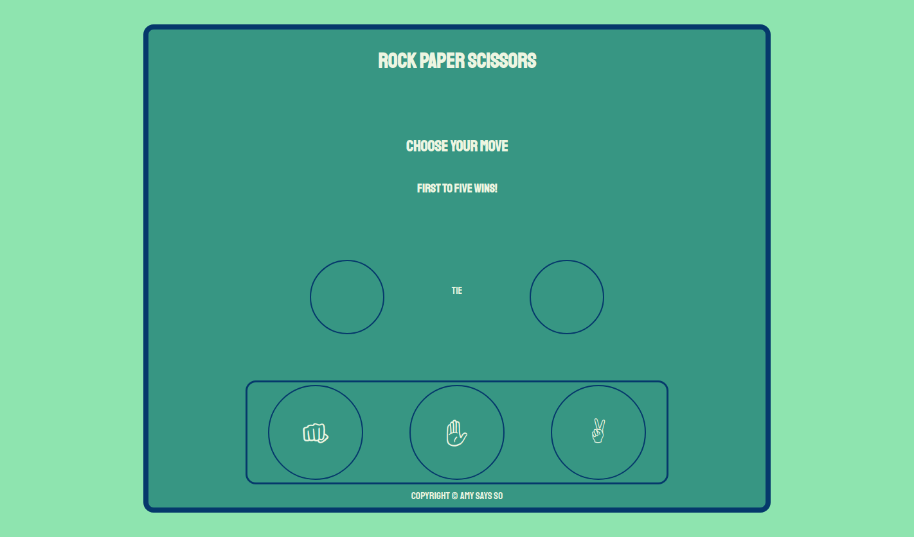

# rps-js

This is an updated version of my Rock Paper Scissors page from The Odin Project. As it was my first JavaScript project, I wanted to go back and have a separate, new repository to gauge progress. Instead of looking at past commits, I chose to have something visual to see differences between. It's also the first page that I've had 4 100's from Google Lighthouse.

For this ititeration, I wanted to practice using different aspects from HTML, CSS, & JavaScript while using code famiilar to me.

On the HTML side, I worked on adding semantic HTML to better understand Accessability and how screen readers work. Also, the lines inside the <head> tag had practically been ignored by me in other projects. I wanted to take the time to understand rel="preconnect" and rel="preload" with css <link> tags to optimize the page's Google Lighthouse score.
  
  
With the CSS, I spent time messing around with linear-gradients. I've seen it used for body background filler and wanted to become more familiar with it. I wanted to challenge myself to use less tags in my HTML. Some of my more current <a href="http://www.theodinproject.com"> The Odin Project </a> assignments were getting bogged down with nested tags so I opted for more grid practice. Unfortunately, while it allowed for more control with responsive layout, it added a lot of lines I didn't want in my CSS file. I may want to experiment with using different CSS files for media queries as Google Lighthouse has suggested. I still need to finish editting the colors for the display text as it's a little blurry (don't knwo how it passed lighthouse). Overall, I'm really enjoying where my CSS comfort level is curretnly and may branch into Tailwind, Bootstrap, or Bulma soon.
  

The JavaScript section surprised me the most. I've been working on incorporating ES6 features into my code so I tried my hand at using Class Methods. I've seen that React uses Classes heavily and am wanting to use them as much as possible before I dive into React. I was able to remove excess functions and variables with this iteration which has been a problem. I still need more practice with data attributes which is something I will work into the JavaScript Calculator.

The current iteration of the game is responsive for the most part while still a little clunky.

The Current Mobile Version
  

  
The Old Mobile Version
  

  
The Current Browser Version
  

 The Old Browser Version
  

The playable version of the first browser game and repository are below if anyone wants to critique and send me a message with any input.

<a href="https://archdukechilly.github.io/rps_game/">Playable Version</a>

<a href="https://github.com/ArchdukeChilly/rps_game">Repository</a>

the <a href="https://www.theodinproject.com/paths/foundations/courses/foundations/lessons/rock-paper-scissors">instructions</a> for the intial console.log portion of the project are found on <a href="http://www.theodinproject.com"> The Odin Project </a>  with the supplemental information for the <a href="https://www.theodinproject.com/paths/foundations/courses/foundations/lessons/revisiting-rock-paper-scissors"> browser capable</a> instructions in a later section.

This whole process has been fun to catalog and see the progress I've made in a few months with working, going to school, trying to be a capable husband and friend, and living life as it throws curveballs at me. My <a href="https://github.com/ArchdukeChilly/rps_game_attempt1">original attempt</a> feels like years ago.
